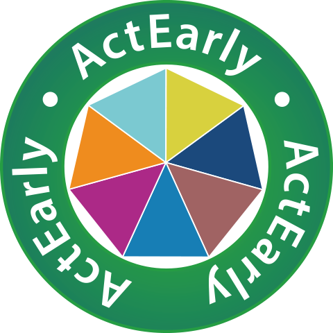

# ActEarly
<!-- PROJECT LOGO -->
 

  

ActEarly is a UKPRP funded research consortium which focusses on upstream early life interventions to improve the health and opportunities for children living in two contrasting areas with high levels of child poverty: Bradford, Yorkshire and Tower Hamlets, London.
This repository contains ActEarly core outcome set data dictionaries and Table1

This study uses standardised and psuedononymised routine data from the Connected Bradford database. Connected Bradford is a dynamic and comprehensive database hosted by Bradford Teaching Hospitals NHS Foundation Trust. This repository of knowledge resides within the Secure Data Environment (SDE), underpinned by Google Cloud. The Connected Bradford database is a gateway to a wealth of information, insights, and opportunities to make a positive impact on wider health inequalties. 

Connected Bradford links anonymous routine data across primary and secondary care with local authority social care and education datasets from the Department for Education (DfE). A scoping exercise to identify the most appropriate datasets and variables is currently being carried out for the final core outcome sets for early years (COS-EY). Analysts on this project will use secure, effective and efficient data visualisation to display actionable insights for local citizens, practitioners, commissioners and policy makers. 

Using timestamps on data collection, extraction or diagnosis dates and where suitable, trends over specific time periods will be displayed. Previous examples of data visualisations using related datasets include bar and line charts, data tables with filters, Radial Sets and linkage to Google Maps ‘heat maps’ by linking to lower-layer super output areas (LSOA), middle-layer super output areas (MSOA) and partial postcode information. Developers of the dashboard(s) also plan to overlay additional relevant information on dashboards, with text boxes and labels. This will be discussed with the relevant theme leads and researchers. It is possible that more definitive and direct conclusions could be afforded space in future, as well as survey or data results related to the core outcomes.

### :man_student: COS-EY 1: Development & education

#### 1.1 Access to education

[Definition & Metrics to be agreed]

#### 1.2 Speech, language & communication

   
###### [1.2 - Listening & attention]

 
 [Table1](https://github.com/ConnectedBradford/CB_1935_Promotion-of-Early-life-Health-and-Wellbeing/blob/main/docs/1.2%20listening%20and%20attention.pdf)

 
  [Graphs]

   
###### [1.2  - Understanding]

 
 [Table1](https://github.com/ConnectedBradford/CB_1935_Promotion-of-Early-life-Health-and-Wellbeing/blob/main/docs/1.2%20understanding.pdf)

 
  [Graphs]

###### [1.2 - Speaking]
 
   [Table1](https://github.com/ConnectedBradford/CB_1935_Promotion-of-Early-life-Health-and-Wellbeing/blob/main/docs/1.2%20Speaking.pdf) 
   
   [Graphs]

   
 ###### [1.2 Good Learning Development]

 
 [Table1]

 
[Graphs]

   
#### 1.3 Emotional & social development

 ###### [1.3 Self-confidence and self-awareness]
 
  [Table1]

 
[Graphs]

 ###### [1.3 Managing feelings and behaviour]
 
  [Table1]

 
[Graphs]
 
  ###### [1.3 Making relationships]
  [Table1]

 
[Graphs]
 

#### 1.4 Children get best start in life

  ###### [1.4 Smoking status at booking appointment ]
  [Table1]

 
[Graphs]

   ###### [1.4 Alcohol consumption at booking appointment ]
  [Table1]
  
###### [1.4 BMI at booking appointment ]
  [Table1]
  
###### [1.4  percentage of children achieving the expected level in personal-social skills at 2-2½ years ]
  [Table1]
  
###### [1.4  percentage of children achieving the expected level in Communication skills at 2-2½ years ]
  [Table1]

#### 1.5 Educational attainment 

###### [1.5 GCSE]
  [Table1]

[Graphs]

###### [1.5 ALevel ]
  [Table1]

#### 1.6 Access to books

[Definition & Metrics to be agreed]

### :swimming_woman: COS-EY 2: Physical health & health behaviors

#### 2.1 Child physical activity

###### [2.1 Percentage of physically active children and young people]
[FingerTips](https://fingertips.phe.org.uk/profile/physical-activity/data#page/4/gid/1938132899/pat/6/ati/401/are/E08000032/iid/93570/age/246/sex/4/cat/-1/ctp/-1/yrr/1/cid/4/tbm/1)

 
#### 2.2 Child sedentary behavior

###### [2.2 Utilisation of outdoor space for exercise/health reasons]
[FingerTips](https://fingertips.phe.org.uk/search/outdoor%20space%20exercise#page/4/gid/1/pat/15/ati/401/are/E08000032/iid/11601/age/164/sex/4/cat/-1/ctp/-1/yrr/1/cid/4/tbm/1)

#### 2.3 Healthy eating
[FingerTips](https://fingertips.phe.org.uk/search/5%20day#page/4/gid/1/pat/502/par/E08000032/ati/501/iid/93077/age/164/sex/4/cat/-1/ctp/-1/yrr/1/cid/4/tbm/1)

#### 2.4 Child weight

#### 2.5 Childhood obesity

###### [2.5 BMI in Reception age children]
  [Table1]
  
###### [2.5 BMI in Year 6 children]
  [Table1]
  
#### 2.6 Adult obesity
###### [2.6 Percentage of adults (aged 18 plus) classified as overweight or obese]
[FingerTips](https://fingertips.phe.org.uk/search/obesity#page/4/gid/1/pat/15/ati/502/are/E08000032/iid/93088/age/168/sex/4/cat/-1/ctp/-1/yrr/1/cid/4/tbm/1)

###### [2.6 Percentage of physically active adults]
  [Table1]

### :smiley: COS-EY 3: Mental health
#### 3.1 Child happiness

###### [3.1 Self-reported wellbeing - people with a low satisfaction score]
[FingerTips](https://fingertips.phe.org.uk/search/self%20reported%20wellbeing#page/4/gid/1/pat/15/ati/502/are/E08000032/iid/22301/age/164/sex/4/cat/-1/ctp/-1/yrr/1/cid/4/tbm/1)

###### [3.1 Self-reported wellbeing - people with a low worthwhile score]
[FingerTips](https://fingertips.phe.org.uk/search/happiness#page/4/gid/1/pat/15/ati/502/are/E08000032/iid/22302/age/164/sex/4/cat/-1/ctp/-1/yrr/1/cid/4/tbm/1)

###### [3.1 Self-reported wellbeing - people with a low happiness score]
[FingerTips](https://fingertips.phe.org.uk/search/happiness#page/4/gid/1938132831/pat/15/par/E92000001/ati/502/are/E08000032/iid/22303/age/164/sex/4/cat/-1/ctp/-1/yrr/1/cid/4/tbm/1)

###### [3.1 Self-reported wellbeing - people with a high anxiety score]
[FingerTips](https://fingertips.phe.org.uk/search/happiness#page/4/gid/1938132831/pat/15/par/E92000001/ati/502/are/E08000032/iid/22304/age/164/sex/4/cat/-1/ctp/-1/yrr/1/cid/4/tbm/1)

#### 3.2 Child mental health (incl. children’s stress and anxiety) & 3.3 Child mental well-being
###### [3.2 Percentage of children who are at risk (RS)]
[Table1]

[Graphs]

###### [3.2 Percentage of children with a referral to CAHMS (RS)]
[Table1]

[Graphs]

###### [3.2 Percentage of looked after children whose emotional wellbeing is a cause for concern]
[FingerTips](https://fingertips.phe.org.uk/search/emotional#page/4/gid/1/pat/15/ati/502/are/E08000032/iid/92315/age/246/sex/4/cat/-1/ctp/-1/yrr/1/cid/4/tbm/1)

###### [3.2 Self-reported wellbeing - people with a low satisfaction score ]
[FingerTips](https://fingertips.phe.org.uk/search/self%20reported%20wellbeing#page/4/gid/1/pat/15/ati/502/are/E08000032/iid/22301/age/164/sex/4/cat/-1/ctp/-1/yrr/1/cid/4/tbm/1)

###### [3.2 Self-reported wellbeing - people with a low worthwhile score]
[FingerTips](https://fingertips.phe.org.uk/search/happiness#page/4/gid/1/pat/15/ati/502/are/E08000032/iid/22302/age/164/sex/4/cat/-1/ctp/-1/yrr/1/cid/4/tbm/1
)
###### [3.2 Self-reported wellbeing - people with a low happiness score]
[FingerTips](https://fingertips.phe.org.uk/search/happiness#page/4/gid/1938132831/pat/15/par/E92000001/ati/502/are/E08000032/iid/22303/age/164/sex/4/cat/-1/ctp/-1/yrr/1/cid/4/tbm/1)

###### [3.2 Self-reported wellbeing - people with a high anxiety score]
[FingerTips](https://fingertips.phe.org.uk/search/happiness#page/4/gid/1938132831/pat/15/par/E92000001/ati/502/are/E08000032/iid/22304/age/164/sex/4/cat/-1/ctp/-1/yrr/1/cid/4/tbm/1)

#### 3.4 Parental mental health & 3.5 Parental mental well-being]
###### [3.4 Proportion of adults in contact with secondary mental health services in paid employment ]
[FingerTips](https://fingertips.phe.org.uk/search/employment#page/4/gid/1/pat/15/ati/502/are/E08000032/iid/93981/age/208/sex/4/cat/-1/ctp/-1/yrr/1/cid/4/tbm/1)

###### [3.4 The percentage of the population with a physical or mental long term health condition in employment (aged 16 to 64)]
[FingerTips](https://fingertips.phe.org.uk/search/employment#page/4/gid/1/pat/15/ati/502/are/E08000032/iid/93882/age/204/sex/4/cat/-1/ctp/-1/yrr/1/cid/4/tbm/1)

###### [3.4 Adults with a learning disability who live in stable and appropriate accommodation]
[FingerTips](https://fingertips.phe.org.uk/search/stable%20appropriate#page/4/gid/1/pat/15/ati/502/are/E08000032/iid/10601/age/183/sex/4/cat/-1/ctp/-1/yrr/1/cid/4/tbm/1)

###### [3.4 Adults in contact with secondary mental health services who live in stable and appropriate accommodation]
[FingerTips](https://fingertips.phe.org.uk/search/adult%20secondary%20mental%20health%20service#page/4/gid/1/pat/15/ati/502/are/E08000032/iid/10602/age/208/sex/4/cat/-1/ctp/-1/yrr/1/cid/4/tbm/1)

###### [3.4 Gap in the employment rate for those in contact with secondary mental health services and the overall employment rate]
[FingerTips](https://fingertips.phe.org.uk/search/employment%20rate#page/4/gid/1/pat/15/ati/502/are/E08000032/iid/90635/age/208/sex/4/cat/-1/ctp/-1/yrr/1/cid/4/tbm/1)

###### [3.4 Sickness absence - The percentage of employees who had at least one day off in the previous week]
[FingerTips](https://fingertips.phe.org.uk/search/sickness%20absence#page/4/gid/1/pat/15/ati/502/are/E08000032/iid/90286/age/164/sex/4/cat/-1/ctp/-1/yrr/3/cid/4/tbm/1)

###### [3.4 Sickness absence - the percentage of working days lost due to sickness absence]
[FingerTips](https://fingertips.phe.org.uk/search/sickness%20absence#page/4/gid/1/pat/15/ati/502/are/E08000032/iid/90287/age/164/sex/4/cat/-1/ctp/-1/yrr/3/cid/4/tbm/1)

###### [3.4 Social Isolation: percentage of adult social care users who have as much social contact as they would like (18+ yrs)]
[FingerTips](https://fingertips.phe.org.uk/search/ADULTS%20IN%20SOCIAL%20CARE#page/4/gid/1/pat/15/ati/502/are/E08000032/iid/90280/age/168/sex/4/cat/-1/ctp/-1/yrr/1/cid/4/tbm/1)

###### [3.4 Loneliness: Percentage of adults who feel lonely often / always or some of the time]
[FingerTips](https://fingertips.phe.org.uk/search/loneliness#page/4/gid/1/pat/15/ati/502/are/E08000032/iid/93758/age/164/sex/4/cat/-1/ctp/-1/yrr/1/cid/4/tbm/1)

###### [3.4 Emergency Hospital Admissions for Intentional Self-Harm]
[FingerTips](https://fingertips.phe.org.uk/search/emergency%20hospital#page/4/gid/1/pat/15/ati/502/are/E08000032/iid/21001/age/1/sex/4/cat/-1/ctp/-1/yrr/1/cid/4/tbm/1)

###### [3.4 Smoking Prevalence in adults (18+) - current smokers (APS)]
[FingerTips](https://fingertips.phe.org.uk/search/adult%20smoking#page/4/gid/1/pat/15/ati/502/are/E08000032/iid/92443/age/168/sex/4/cat/-1/ctp/-1/yrr/1/cid/4/tbm/1)

###### [3.4 Successful completion of drug treatment - opiate users]
[FingerTips](https://fingertips.phe.org.uk/search/opiate%20drug%20users#page/4/gid/1/pat/15/ati/502/are/E08000032/iid/90244/age/168/sex/4/cat/-1/ctp/-1/yrr/1/cid/4/tbm/1)

###### [3.4 Successful completion of drug treatment - non-opiate users]
[FingerTips](https://fingertips.phe.org.uk/search/opiate%20drug%20users#page/4/gid/1938132834/pat/15/par/E92000001/ati/502/are/E08000032/iid/90245/age/168/sex/4/cat/-1/ctp/-1/yrr/1/cid/4/tbm/1)

###### [3.4 Successful completion of alcohol treatment]
[FingerTips](https://fingertips.phe.org.uk/search/successful%20treatment#page/4/gid/1/pat/15/ati/502/are/E08000032/iid/92447/age/168/sex/4/cat/-1/ctp/-1/yrr/1/cid/4/tbm/1)

###### [3.4 Deaths from drug misuse]
[FingerTips](https://fingertips.phe.org.uk/search/drug#page/4/gid/1/pat/15/ati/502/are/E08000032/iid/92432/age/1/sex/4/cat/-1/ctp/-1/yrr/3/cid/4/tbm/1)

###### [3.4 Admission episodes for alcohol-related conditions (Narrow): New method. This indicator uses a new set of attributable fractions, and so differ from that originally published. (Persons)]
[FingerTips](https://fingertips.phe.org.uk/search/attributable#page/4/gid/1/pat/15/ati/502/are/E08000032/iid/91414/age/1/sex/4/cat/-1/ctp/-1/yrr/1/cid/4/tbm/1)

###  :family_man_woman_girl_boy: COS-EY 4: Social environment
#### 4.1 Family & social relationships
###### [4.1 percentage of children achieving the expected level in personal-social skills at 2-2½ years ]
  [Table1]

#### 4.2 Safety at home

###### [4.2 Hospital admissions caused by unintentional and deliberate injuries in children (aged 0-14 years) ]

[FingerTips](https://fingertips.phe.org.uk/search/children%20injuries#page/4/gid/1/pat/6/par/E12000003/ati/201/are/E08000032/iid/90284/age/26/sex/4/cat/-1/ctp/-1/yrr/1/cid/4/tbm/1/page-options/ovw-do-0_car-do-0_tre-ao-0_tre-do-0)

#### 4.3 Domestic abuse
This is only available on a regional level 

[FingerTips](https://fingertips.phe.org.uk/search/emotional#page/4/gid/1/pat/15/ati/6/are/E12000003/iid/92315/age/246/sex/4/cat/-1/ctp/-1/yrr/1/cid/4/tbm/1)

#### 4.4 Child social relationships & bullying

###### [4.4 percentage of children achieving the expected level in personal-social skills at 2-2½ years ]
  [Table1]
  
  ###### [4.4 Emergency Hospital Admissions for Intentional Self-Harm ]
[FingerTips](https://fingertips.phe.org.uk/search/self%20harm#page/0/gid/1/pat/15/par/E92000001/ati/501/are/E08000032/iid/21001/age/1/sex/4/cat/-1/ctp/-1/yrr/1/cid/4/tbm/1)

### :house_with_garden: COS-EY 5: Physical environment

#### 5.1 Use, quality, and satisfaction with open space
###### [5.1 Percentage of physically active adults]
  [Table1]

#### 5.2 Parks & green spaces (incl. access to green space)

  ###### [5.2 Utilisation of outdoor space for exercise/health reasons ]
[FingerTips](https://fingertips.phe.org.uk/search/outdoor%20space%20exercise#page/4/gid/1/pat/15/ati/502/are/E08000032/iid/11601/age/164/sex/4/cat/-1/ctp/-1/yrr/1/cid/4/tbm/1)

#### 5.3 Access to high quality health services

 Change 'Indicator' filter on the link below for more specific information 
 
[Fingertips](https://fingertips.phe.org.uk/profile/general-practice/data#page/4/gid/2000005/pat/66/par/nE38000232/ati/7/are/B83063/iid/93438/age/164/sex/4/cat/-1/ctp/-1/yrr/1/cid/4/tbm/1/page-options/tre-ao-1)

#### 5.4 Air pollution

  ###### [5.4 Fraction of mortality attributable to particulate air pollution]
[Fingertips](https://fingertips.phe.org.uk/search/particulate#page/4/gid/1/pat/15/ati/502/are/E08000032/iid/93861/age/230/sex/4/cat/-1/ctp/-1/yrr/1/cid/4/tbm/1)
#### 5.5 Food availability
 ######  [5.5 Food availability]
[FingerTips](https://fingertips.phe.org.uk/search/5%20day#page/4/gid/1/pat/502/par/E08000032/ati/501/iid/93077/age/164/sex/4/cat/-1/ctp/-1/yrr/1/cid/4/tbm/1)

#### 5.6 Quality of local environment
  ######  [5.6 The rate of complaints about noise]
 [FingerTips](https://fingertips.phe.org.uk/profile/wider-determinants/data#page/4/gid/1938133043/pat/15/ati/501/are/E08000032/iid/11401/age/1/sex/4/cat/-1/ctp/-1/yrr/1/cid/4/tbm/1)

 ######  [5.6 The percentage of the population exposed to road, rail and air transport noise of 65dB(A) or more, during the daytime]
[FingerTips](https://fingertips.phe.org.uk/profile/wider-determinants/data#page/4/gid/1938133043/ati/502/iid/90357/age/1/sex/4/cat/-1/ctp/-1/yrr/1/cid/4/tbm/1/page-options/tre-ao-0)

 ######  [5.6 The percentage of the population exposed to road, rail and air transport noise of 55 dB(A) or more during the night-time]
[FingerTips](https://fingertips.phe.org.uk/profile/wider-determinants/data#page/4/gid/1938133043/pat/15/par/E92000001/ati/502/are/E08000032/iid/90358/age/1/sex/4/cat/-1/ctp/-1/yrr/1/cid/4/tbm/1/page-options/tre-ao-0)

#### 5.7 Traffic (incl. traffic levels outside schools, parking)
 ######  [5.7 Killed and seriously injured (KSI) casualties on England's roads]
[FingerTips](https://fingertips.phe.org.uk/search/killed%20and%20seriously%20injured%20on%20roads#page/4/gid/1/pat/15/ati/501/are/E08000032/iid/93754/age/1/sex/4/cat/-1/ctp/-1/yrr/1/cid/4/tbm/1)

 ######  [5.7 The rate of complaints about noise]
[FingerTips](https://fingertips.phe.org.uk/profile/wider-determinants/data#page/4/gid/1938133043/pat/6/ati/501/are/E08000032/iid/11401/age/1/sex/4/cat/-1/ctp/-1/yrr/1/cid/4/tbm/1)

 ######  [5.7 The percentage of the population exposed to road, rail and air transport noise of 65dB(A) or more, during the daytime]
[FingerTips](https://fingertips.phe.org.uk/profile/wider-determinants/data#page/4/gid/1938133043/ati/502/iid/90357/age/1/sex/4/cat/-1/ctp/-1/yrr/1/cid/4/tbm/1/page-options/tre-ao-0)

 ######  [5.7 The percentage of the population exposed to road, rail and air transport noise of 55 dB(A) or more during the night-time]
[FingerTips](https://fingertips.phe.org.uk/profile/wider-determinants/data#page/4/gid/1938133043/pat/15/par/E92000001/ati/502/are/E08000032/iid/90358/age/1/sex/4/cat/-1/ctp/-1/yrr/1/cid/4/tbm/1/page-options/tre-ao-0)

### :chart_with_upwards_trend: COS-EY 6: Poverty & inequality
#### 6.1 Housing (incl. homelessness; house crowding; availability of affordable housing)

 ######  [6.1 Homelessness - Number of households owed a duty under the Homelessness Reduction Act]
[FingerTips](https://fingertips.phe.org.uk/search/housing#page/4/gid/1/pat/15/ati/501/are/E08000032/iid/93736/age/-1/sex/-1/cat/-1/ctp/-1/yrr/1/cid/4/tbm/1)

 ######  [6.1 Homelessness - households in temporary accommodation]
[No Data]

 ######  [6.1 Fuel poverty (low income, high cost methodology)]
[No Data]

 ######  [6.1 Fuel poverty (low income, low energy efficiency methodology)]
[FingerTips](https://fingertips.phe.org.uk/search/fuel%20poverty#page/4/gid/1/pat/6/ati/501/are/E08000032/iid/93759/age/-1/sex/-1/cat/-1/ctp/-1/yrr/1/cid/4/tbm/1)

#### 6.2 Access to opportunity
[Definition & Metrics to be agreed]
#### 6.3 Basic care needs met
 ######  [6.3 Vaccine coverage]
 Change 'Indicator' filter to choose specific vaccination trends
[FingerTips](https://fingertips.phe.org.uk/search/vaccination#page/4/gid/1/pat/15/ati/502/are/E08000032/iid/30301/age/30/sex/4/cat/-1/ctp/-1/yrr/1/cid/4/tbm/1)

 
 ######  [6.3 Newborn Blood Spot Screening - Coverage]
 only available at regional level
 
 [FingerTips](https://fingertips.phe.org.uk/search/screen#page/4/gid/1/pat/15/ati/6/are/E12000003/iid/91323/age/2/sex/4/cat/-1/ctp/-1/yrr/1/cid/4/tbm/1)
 
 ######  [6.3 Newborn Hearing Screening - Coverage]
  [FingerTips](https://fingertips.phe.org.uk/search/screen#page/4/gid/1938133257/pat/15/ati/502/are/E08000032/iid/91324/age/2/sex/4/cat/-1/ctp/-1/yrr/1/cid/4/tbm/1)
  
 ######  [6.3  Newborn and Infant Physical Examination Screening - Coverage]
  [FingerTips](https://fingertips.phe.org.uk/search/screen#page/4/gid/1000042/pat/15/par/E92000001/ati/502/are/E08000032/iid/92371/age/2/sex/4/cat/-1/ctp/-1/yrr/1/cid/4/tbm/1)

 ######  [6.3  Proportion of New Birth Visits (NBVs) completed within 14 days]
 
  [FingerTips](https://fingertips.phe.org.uk/search/birth%20%20%20%20%20visit#page/4/gid/1/pat/15/ati/502/are/E08000032/iid/93469/age/284/sex/4/cat/-1/ctp/-1/yrr/1/cid/4/tbm/1)
  
 ######  [6.3 Percentage of looked after children whose emotional wellbeing is a cause for concern]
 
  [FingerTips](https://fingertips.phe.org.uk/search/emotional#page/4/gid/1/pat/15/ati/502/are/E08000032/iid/92315/age/246/sex/4/cat/-1/ctp/-1/yrr/1/cid/4/tbm/1)
  
 ######  [6.3 Successful completion of drug treatment - opiate users]
  [FingerTips](https://fingertips.phe.org.uk/search/opiate%20drug%20users#page/4/gid/1/pat/15/ati/502/are/E08000032/iid/90244/age/168/sex/4/cat/-1/ctp/-1/yrr/1/cid/4/tbm/1)

#### 6.4 Employment
 ######  [6.4 16-17 year olds not in education, employment or training (NEET) or whose activity is not known]
  [FingerTips](https://fingertips.phe.org.uk/search/neet#page/4/gid/1/pat/15/ati/502/are/E08000032/iid/93203/age/174/sex/4/cat/-1/ctp/-1/yrr/1/cid/4/tbm/1)
  
 ######  [6.4 Gap in the employment rate between those with a long-term health condition and the overall employment rate]
  [FingerTips](https://fingertips.phe.org.uk/search/employment#page/4/gid/1/pat/15/ati/502/are/E08000032/iid/90282/age/204/sex/4/cat/-1/ctp/-1/yrr/1/cid/4/tbm/1)
  
 ######  [6.4 Gap in the employment rate between those with a learning disability and the overall employment rate]
  [FingerTips](https://fingertips.phe.org.uk/search/employment#page/4/gid/1/pat/15/ati/502/are/E08000032/iid/90283/age/183/sex/4/cat/-1/ctp/-1/yrr/1/cid/4/tbm/1)
  
###### [6.4 Sickness absence - The percentage of employees who had at least one day off in the previous week]
[FingerTips](https://fingertips.phe.org.uk/search/sickness%20absence#page/4/gid/1/pat/15/ati/502/are/E08000032/iid/90286/age/164/sex/4/cat/-1/ctp/-1/yrr/3/cid/4/tbm/1)

###### [6.4 Sickness absence - the percentage of working days lost due to sickness absence]
[FingerTips](https://fingertips.phe.org.uk/search/sickness%20absence#page/4/gid/1/pat/15/ati/502/are/E08000032/iid/90287/age/164/sex/4/cat/-1/ctp/-1/yrr/3/cid/4/tbm/1)

 ######  [6.4 Gap in the employment rate for those in contact with secondary mental health services and the overall employment rate]
  [FingerTips](https://fingertips.phe.org.uk/search/employment%20rate#page/4/gid/1/pat/15/ati/502/are/E08000032/iid/90635/age/208/sex/4/cat/-1/ctp/-1/yrr/1/cid/4/tbm/1)
   

#### 6.5 Financial stability
 ######  [6.4 Children in low income families (all dependent children under 20)]
  [FingerTips](https://fingertips.phe.org.uk/search/child%20poverty#page/4/gid/1/pat/15/ati/502/are/E08000032/iid/90630/age/199/sex/4/cat/-1/ctp/-1/yrr/1/cid/4/tbm/1)

#### 6.6 Inequalities

#### 6.7 Poverty

